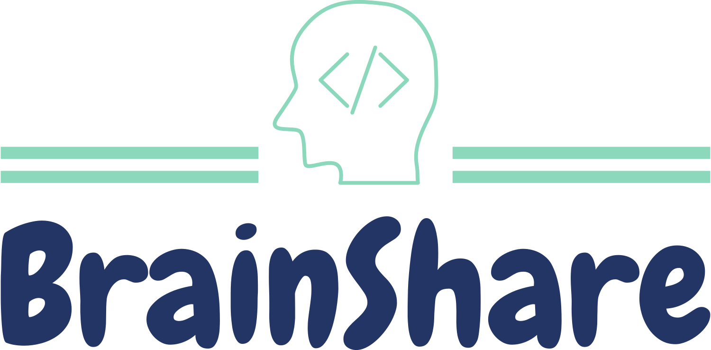

## A/B Test #1

### A/B Test Name: 
Dark Theme or Light Theme
### User Story Number: 
1
### Metric (from the HEART grid): 
Average session duration, net positivity score, download rates
### Hypothesis: 
We notice on a lot of popular applications from Twitter, Instagram, to GitHub and Discord that people tend to prefer dark mode theme. We believe that this has something to do with the typical user spending a lot of time scrolling through these apps, and Dark Mode makes it easier on the user's eyes when looking at their screen. We want to see the difference between a lighter theme that may come off as more innovative and clean versus a dark theme that may be more sleek and easy on the eyes. And most importantly, we want to see if this may have anything to do with the amount of time the users spend on the app.
### Experiment - 
For our experiment we will push out two versions to our users, as for the audiences we will be targetting, it will be 50% across the board, each half will have every demographic equally represented to simulate two equal cohorts. The reason for this is to keep a controlled experiment, with something like theme of the app, we believe that there isn't necessarily going to be certain demographics that like or dislike it more in particular, it would primarily be preference based, so having two equal cohorts will allow us to have the most accurate conclusion.
### Variations - 
Dark theme UI vs Light theme UI

## A/B Test #2

### A/B Test Name: 
Logo Change
### User Story Number: 
8
### Metric (from the HEART grid): 
Download Rate, Sign Up rate
### Hypothesis: 
By changing our logo, we will be able to increase the adoption rate of our app. This is because the logo is the first thing that users see when going to open the app, as well as represents the application itself, so it must be both appealing to the user and representative of the app itself. Therefore, by changing our logo/color scheme to be more appealing to the user, we will be able to increase the adoption rate of our app.
### Experiment - 
We will use Firebase Remote Config to publish several different app versions, with each variation having a different logo/color scheme. This experiment will be run for one month, in which all app downloads will receive a different logo/color scheme for the application. Then, we will collect analytics regarding the app download rate and sign up rate to determine which logo/color scheme is the most effective.
### Variations -
* Logo 1:

* Logo 2:

* Logo 3:

* Logo 4:

* Logo 5:

* Logo 6:

